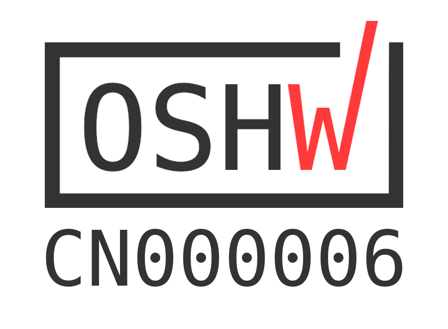

# mPython掌控板
欢迎您，使用掌控板！

mPython掌控板是一块MicroPython微控制器板，它集成ESP32高性能双核芯片，使用当下最流行的Python编程语言，以便您轻松地将代码从桌面传输到微控制器或嵌入式系统。

  

GitHub: https://github.com/labplus-cn/mPython     
mPython掌控板在线文档: https://mPython.readthedocs.io

# 许可信息

掌控板是一个[OSHWA](https://certification.oshwa.org/license-agreement.html) 认证的开源硬件项目,代码和设计都是开源。但软件须在[GPL-3](http://www.gnu.org/licenses/gpl.html)许可下使用,硬件在CERN许可下使用,文档在CC0许可下使用。

# 联系我们

如果您对文档或掌控板的使用有任何建议或疑问，请在Github上创建一个问题，以便与他人共享答案和解决方案。
